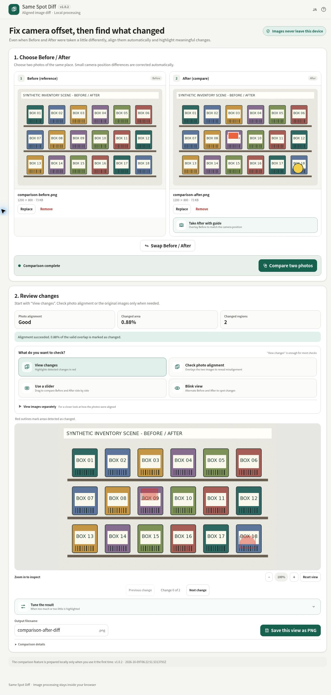

# Same Spot Diff

[](https://github.com/ttomohisa/htmlapps-same-spot-diff/actions/workflows/deploy-pages.yml)
[](LICENSE)
[](https://ttomohisa.github.io/htmlapps-same-spot-diff/)

[日本語版 README](README.ja.md)

A privacy-focused, single-HTML app for comparing Before / After photos even when they were not taken from exactly the same camera position.

Same Spot Diff automatically aligns the two photos first, then highlights the places that actually changed. The selected photos and comparison results stay on your device.

## 🚀 Live demo

### [Open Same Spot Diff on GitHub Pages](https://ttomohisa.github.io/htmlapps-same-spot-diff/)

GitHub Pages delivers the initial HTML. After it loads, image alignment, difference detection, zooming, ignored-area masking, Blink view, slider comparison, and PNG export are processed locally in your browser. The photos you select are not uploaded by the app.



## Features

- Automatically align small camera-position, rotation, and perspective differences before comparing photos
- Highlight detected changes in red
- Step through every detected region with **Previous change / Next change**, a position count, and automatic zoom/pan
- Show alignment quality, changed area, and number of changed regions at a glance
- **After camera guide**: overlay the Before photo on the live camera preview to help reproduce the same shooting position
- Compare Before / After with a draggable split slider
- Blink between Before / After at selectable speeds
- Overlay the two aligned photos to check whether positioning is accurate
- Pinch to zoom and drag on mobile; zoom buttons and drag navigation on desktop
- Mark clocks, reflections, displays, foliage, or other naturally changing places as **ignored areas**
- Hide ignored-area outlines without disabling the ignored areas themselves
- Scale the “ignore small changes” threshold according to the comparison image size
- Tune change sensitivity and brightness normalization directly below the result
- Reuse the existing alignment when only difference settings change, avoiding unnecessary realignment
- JPEG / PNG / WebP input
- Save the currently displayed result as PNG
- Japanese / English UI with target-language EN / JA header controls and localized tooltips
- Embedded SVG favicon
- OpenCV JavaScript and WebAssembly embedded in the generated HTML
- No analytics, upload API, runtime CDN, or runtime GitHub download

## Quick start

### Use the web demo

Just [open the demo](https://ttomohisa.github.io/htmlapps-same-spot-diff/). No installation or account is required.

### Use the generated single HTML

1. Download or clone this repository.
2. Open `dist/index.html` in a current browser.
3. Add a Before photo and an After photo.
4. Press **Compare two photos**.

The normal comparison features work from the generated single HTML without a server. The **After camera guide** uses the browser camera API, so it works best from GitHub Pages or another HTTPS origin where camera permission is available.

## Usage

1. Add the **Before** photo.
2. Add the **After** photo, or use **Take After with guide** to match the original camera position while shooting.
3. Press **Compare two photos**.
4. Start with **View changes** to see detected changes highlighted in red.
5. If needed, use **Check photo alignment**, **Use a slider**, or **Blink view** to inspect the result from another angle.
6. Open **Tune the result** only when the red highlighting is too sensitive or not sensitive enough.
7. Add **ignored areas** for places that naturally change every time, such as a clock, reflection, monitor, moving leaves, or similar regions.
8. Zoom and pan for a closer look, then save the current view as PNG if needed.

### Step through changes

Use **Next change** to focus the first detected region, then **Next change / Previous change** to visit every region from largest to smallest. The counter starts at 0 of N; the buttons stop at either end. This includes regions beyond the first 80 red outlines. **Reset view** returns to the overview and clears the position. Switching between Diff, alignment, slider, Blink, or individual images keeps your position.

Navigation changes only zoom and pan within the existing limits. It does not crop the saved PNG or change statistics, masks, or the selected result view. A new comparison, difference-setting update, or image replacement resets the position.

Selecting a supported image up to 40 MB clears the old result and ignored areas immediately. Compare and Save are disabled during decoding. If decoding fails, the prior image stays available, but you must compare again. Cancelling the picker or selecting an unsupported or oversized file leaves the valid source and result intact.

### After camera guide

The camera guide is intended for repeated photos of the same place.

1. Add the Before photo first.
2. In the After card, choose **Take After with guide**.
3. Allow camera access.
4. Match major edges and corners while the Before image is overlaid transparently on the live preview.
5. Adjust the Before opacity or temporarily hide it if useful.
6. Take the photo; it is added directly as After.

The live camera preview and captured image stay on the device. Camera access is used only while the guide is open.

### Result views

| View | Purpose |
| --- | --- |
| **View changes** | Highlight detected differences in red |
| **Check photo alignment** | Overlay the aligned images to check remaining offset |
| **Use a slider** | Drag a divider to compare Before / After side by side |
| **Blink view** | Alternate Before / After to make visual changes easier to spot |
| **Before / After separately** | Inspect either source image without overlays |

### Ignored areas

Ignored areas are useful when part of the scene changes naturally and should not affect the comparison.

- Choose **Add area**, then drag over the result image.
- Use **Undo last** or **Clear all** to edit the mask.
- **Hide outlines** hides only the visual frames; the areas remain excluded from difference detection.
- Adding a new ignored area automatically makes the outlines visible again while editing.

## Good use cases

- Room or furniture Before / After photos
- Construction progress
- Equipment and facility checks
- Store displays and signage
- Product or component appearance checks
- Repeated photos of the same shelf, wall, panel, or workspace

## Publish with GitHub Pages

The repository includes a workflow that builds the standalone HTML, verifies it, and deploys the `dist` directory to GitHub Pages.

1. Push the repository to GitHub as `htmlapps-same-spot-diff`.
2. Open **Settings → Pages → Build and deployment → Source** and select **GitHub Actions**.
3. Push to `main`, or manually run **Deploy standalone app to GitHub Pages** from the Actions tab.
4. After a successful deployment, the app is available at `https://ttomohisa.github.io/htmlapps-same-spot-diff/`.

Each push to `main` runs the repository checks before deployment. If Pages has not been enabled yet, the workflow still validates the build and reports the one-time setup steps instead of failing the app build.

## Development and build layout

```text
.
├─ src/index.template.html       # Application template
├─ app.config.json               # App metadata and build settings
├─ dependencies.json             # Embedded dependency definition
├─ opencv-release.json           # Pinned OpenCV builder release/profile
├─ import-opencv.bat             # Fetch the pinned OpenCV release asset
├─ vendor/opencv/                # Imported OpenCV JS/WASM runtime
├─ build-standalone.bat          # Windows build entry point
├─ build-standalone.ps1          # Standalone HTML builder
├─ scripts/                      # Verification and helper scripts
├─ dist/index.html               # Generated readable single-HTML app
└─ dist/index.self-extract.html  # Smaller self-extracting single HTML
```

## Import the pinned OpenCV runtime

The OpenCV JavaScript/WASM pair is imported from a pinned release of [`htmlapps-opencv-wasm-builder`](https://github.com/ttomohisa/htmlapps-opencv-wasm-builder).

Current pin:

```text
repository: ttomohisa/htmlapps-opencv-wasm-builder
tag: v1.0.0
profile: same-spot-diff
```

On Windows:

```bat
import-opencv.bat
```

The importer:

- Reads the repository, tag, and profile from `opencv-release.json`
- Prefers the dedicated `same-spot-diff` release asset
- Falls back to `browser-kitty-full` if the pinned release does not contain the dedicated profile asset
- Keeps `opencv.js` and `opencv_js.wasm` from the same release asset
- Records the resolved release/asset information in `vendor/opencv/release-source.json`

To test another release temporarily:

```bat
import-opencv.bat v1.0.1
```

For a real dependency update, edit the `tag` in `opencv-release.json` instead.

## Build the standalone app

After importing OpenCV, run:

```bat
build-standalone.bat
```

Generated files include:

```text
dist/
├─ index.html
├─ index.self-extract.html
├─ dependency-manifest.json
├─ self-extract-manifest.json
├─ build-size-report.json
└─ .nojekyll
```

The build gzip-compresses the OpenCV JavaScript/WASM assets and embeds them into the HTML. At runtime the Wasm bytes are instantiated directly from the embedded data rather than fetched from an external URL.

Python, Node.js, and a local web server are not required for the normal Windows build workflow.

## How comparison works

The user-facing UI avoids implementation terminology, but internally the alignment pipeline uses OpenCV:

```text
Before / After
      ↓
ORB feature detection
      ↓
BFMatcher feature matching
      ↓
RANSAC homography
      ↓
Perspective warp
      ↓
Brightness-normalized image difference
      ↓
Threshold + morphology
      ↓
Ignored-area masking + small-region filtering
      ↓
Highlighted change regions
```

The custom OpenCV runtime is intentionally limited to the components needed by this app rather than using an unrestricted general-purpose build when a dedicated release asset is available.

## Privacy and runtime network protection

The generated app is designed so that comparison processing stays local.

- Selected photos are not uploaded by the app
- OpenCV JavaScript and WebAssembly are embedded into the generated HTML
- Runtime Content Security Policy includes `connect-src 'none'`
- The embedded Wasm is instantiated from memory instead of fetched from a runtime URL
- No analytics or external API is used by the comparison workflow
- The After camera guide uses `getUserMedia` only after the user explicitly opens it and grants browser permission

The GitHub Pages version naturally requires the initial page request. After the page has loaded, the app does not send the selected photos to a server. For fully offline comparison, open `dist/index.html` locally. Camera-guide availability depends on the browser's secure-context and camera-permission rules.

See [SECURITY.md](SECURITY.md) and [VERIFY_OFFLINE.md](VERIFY_OFFLINE.md) for additional details.

## Limitations

- Large changes in camera position can create parallax that a single homography cannot correct.
- Scenes with very little texture, such as a plain wall, may not provide enough visual landmarks for reliable alignment.
- Large occlusions or a substantially different composition can prevent alignment.
- Strong shadows, lighting changes, reflections, moving leaves, screens, and clocks may appear as changes unless adjusted or ignored.
- Very large images use more memory; use a lighter **Photo detail** setting if a mobile device becomes unstable.
- The After camera guide requires browser camera support, permission, and normally a secure context such as HTTPS.
- Automatic difference detection is a review aid, not a substitute for final measurement, inspection, or safety-critical judgment.

## Dependencies

| Library | Version | License | Purpose |
| --- | ---: | --- | --- |
| OpenCV | 5.0.0 | Apache-2.0 | Image alignment, perspective correction, and difference processing |

The runtime is imported from the pinned builder release defined in `opencv-release.json`. See [THIRD_PARTY_NOTICES.md](THIRD_PARTY_NOTICES.md) for details.

## Contributing

Bug reports and feature proposals are welcome through GitHub Issues. See [CONTRIBUTING.md](CONTRIBUTING.md) for development guidance.

## License

Copyright © 2026 ttomohisa

Licensed under the [MIT License](LICENSE).

### Runtime regression tests

Run `node --test tests/*.test.cjs` with Node.js 22 or newer; no npm installation is required. The repository check also runs these tests against the source, readable release, decoded self-extract release, and checked-in `same-spot-diff.html`. After rebuilding, copy `dist/index.html` to `same-spot-diff.html` when updating the checked-in release. Tests use synthetic DOM/canvas and controlled image-decoding/OpenCV boundaries, not a browser. Optional `SAME_SPOT_REAL_CANVAS=1` checks use `@napi-rs/canvas` when already installed to compare actual synthetic PNG bytes.
